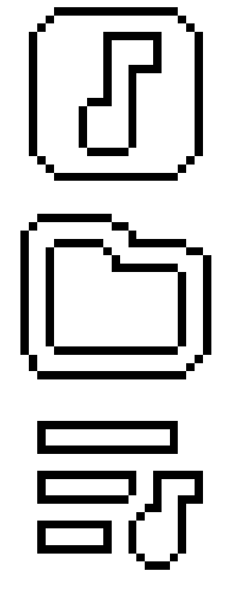
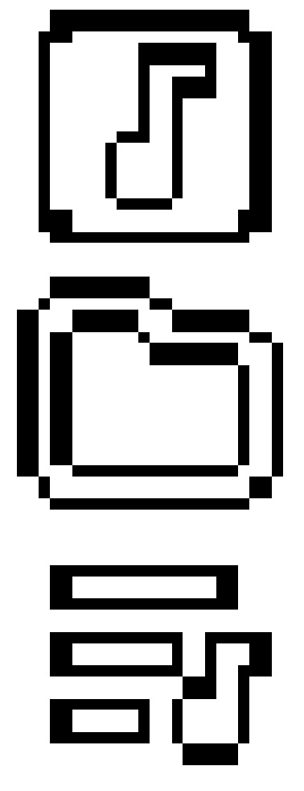

# Migufy Rockbox Theme
Port of Themify, original theme made by Dook and ported to the Innioasis Y1 by rockbox-y1.

It features hand drawn pixel perfect symmetric icons, though im no designer so it might violate some UX guidelines. As well as the Migu 1P font instead of the LeagueSpartan.

## Other Changes
- Hidden sleep indicator
- iPod loading status icon replaced for a play/pause status icon iLike style
- Rearranged wps for better Migu compatibility

## Comparison
| Left Migufy | Right Themify |
|----|----|
|  |  |
| |  |
|  |  |

# Rockbox 360p Themes

## List of themes and credits
For more details on attributions and licenses please look into the files of the corresponding themes.

| Theme | Original Author | Port Author | Changes |
|:-----|:--------|:--------:|:--------:|
| Themify | Dook | rockbox-y1 & ApollosTomato | Remove brightness options, scale fonts and images, adjust list padding |

## Support the original creators!
- Dook, creator of Themify and Adwaitapod: [https://ko-fi.com/dook\_](https://ko-fi.com/dook\_)
